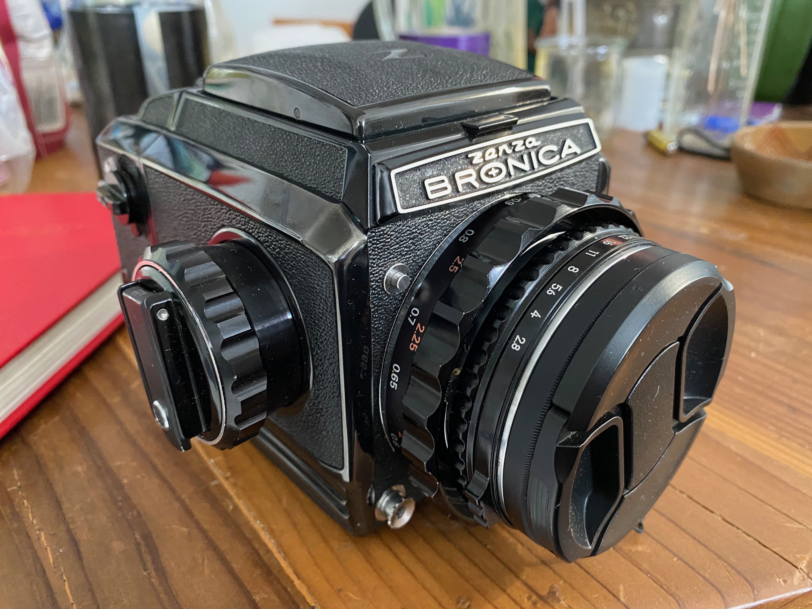
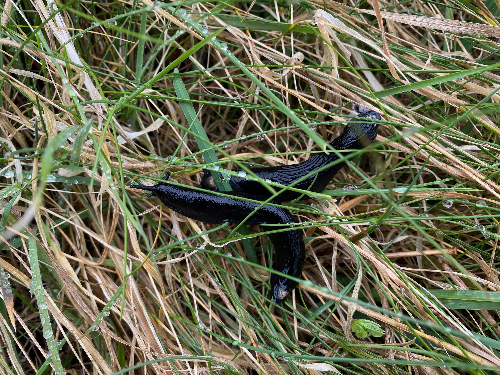

My father taught me how to use his Pentax SLR as a child; for my 13th birthday my parents gifted me a 35mm SLR to call my own. In high school I learned my way around a monochrome darkroom, and in college I learned how to develop color.

I tend to shoot with [Nikon](https://www.nikon.com) cameras, but I've also enjoyed using Olympus and Yashica.

Lately my mainstays are a 35mm Nikon FM, a medium-format [Zenza Bronica](https://en.wikipedia.org/wiki/Bronica) S2A (with Nikkor-P f2.8 75mm), and a digital Nikon zFC (with Nikkor DX 18–140mm) — and an everpresent iPhone.

> 
> _here's the Bronica_

My favorite subject is Mother Nature.

> 
> _Irish slugs enjoying the bounty of the Green Island_

Other topics of interest:  
* ancient structures…  
* street / guerilla art…  
* wide landscapes and panoramas…  
* the juxtaposition nature's splendors with the fallibility of humanity…  
* unexpected vantage points and emergent textures of man-made structures…  

> 
> _unusual textures can be fun_

